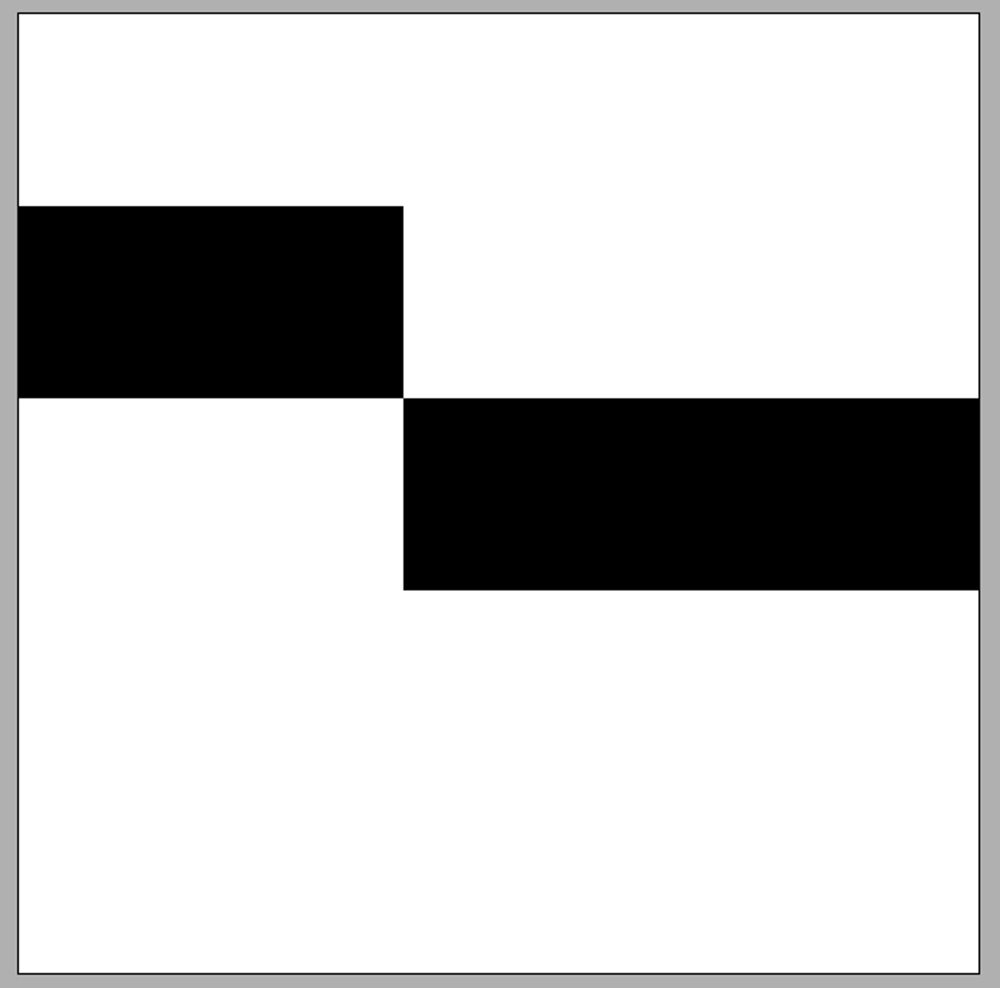

# [실습2] DDA 구현하기 [1/3]

이해를 쉽게 하기 위해서 실습 문제 3개로 쪼개서 단계별로 구현을 해봅시다.

먼저, 넓이 방향 스텝(step)을 사용하는 경우에 대해서만 먼저 구현해봅시다.

-   즉, abs(x1-x0) >= abs(y1-y0) 라고 가정하고 문제를 풀어본 후에 다음 예제에서 확장해봅시다.

5x5 해상도의 이미지에 (0, 1)에서 (4, 2)까지 선분을 그려봅시다.

-   abs(4-0) > abs(2-1)인 경우이기 때문에 넓이 방향 step을 사용할 수 있는 경우입니다.

주어진 코드에 빈칸 채우기 방식으로 구현해보세요.

-   main() 함수에서 Case1, Case2가 이미 구현되어 있는 것을 보실 수 있습니다. 먼저 Case1에 대해 정상 작동하도록 코드를 완성해봅시다.
-   Case1의 예상 실행 결과는 강의 동영상의 예제와 동일합니다. 아래 이미지 참고하세요.
-   Swap() 함수는 시작점과 끝점의 순서를 바꿔야하는 경우에 사용합니다.
-   코드를 간결하게 만들기 위해서 RGB 클래스를 사용하고 있습니다. 참고하세요.

<예시>

