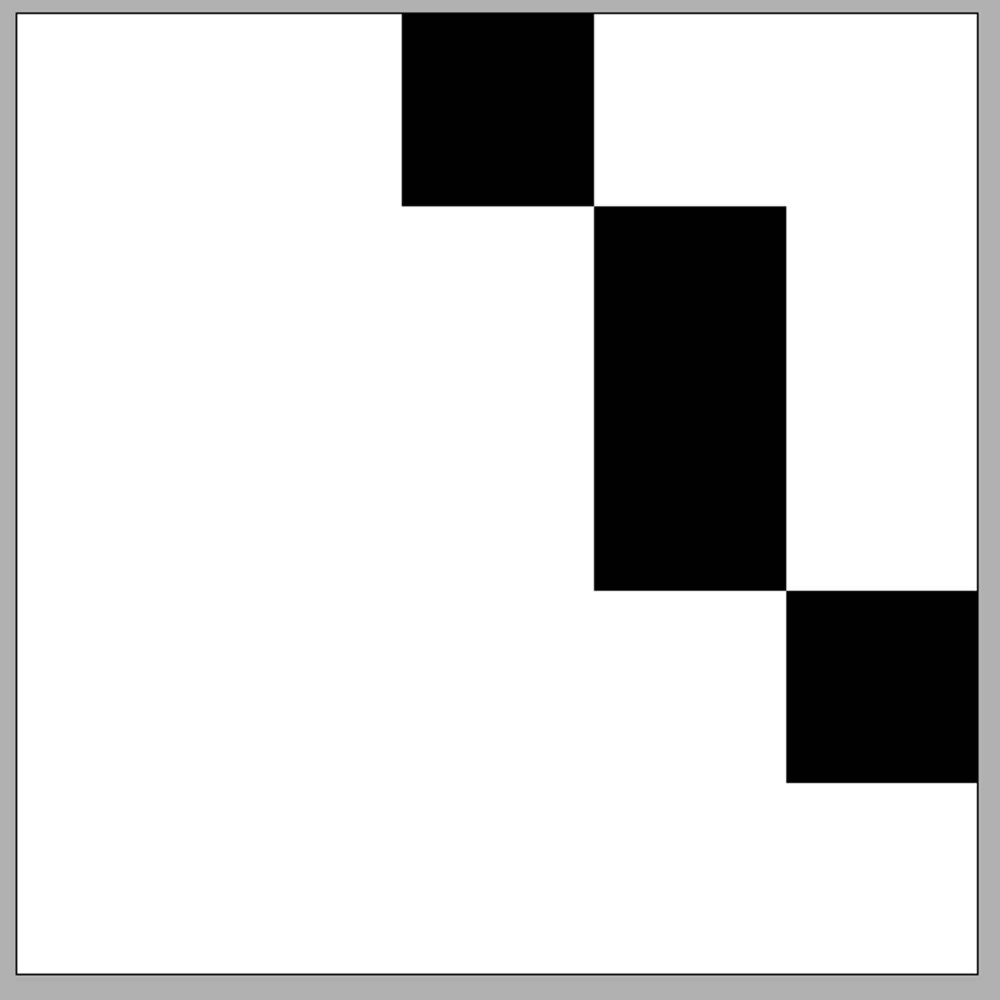

# [실습3] DDA 구현하기 [2/3]

넓이 방향 스텝을 사용해야 하는 경우와 높이 방향 스텝을 사용해야 하는 경우 모두 정상 작동하도록 drawLineTest2() 함수를 완성해보세요.

-   예상 결과: 넓이 방향 스텝을 사용해야 하는 Case 1은 앞 예제와 동일하고 높이 방향 스텝을 사용해야 하는 Case 2는 아래와 같은 결과가 나와야 합니다.

<예시>

