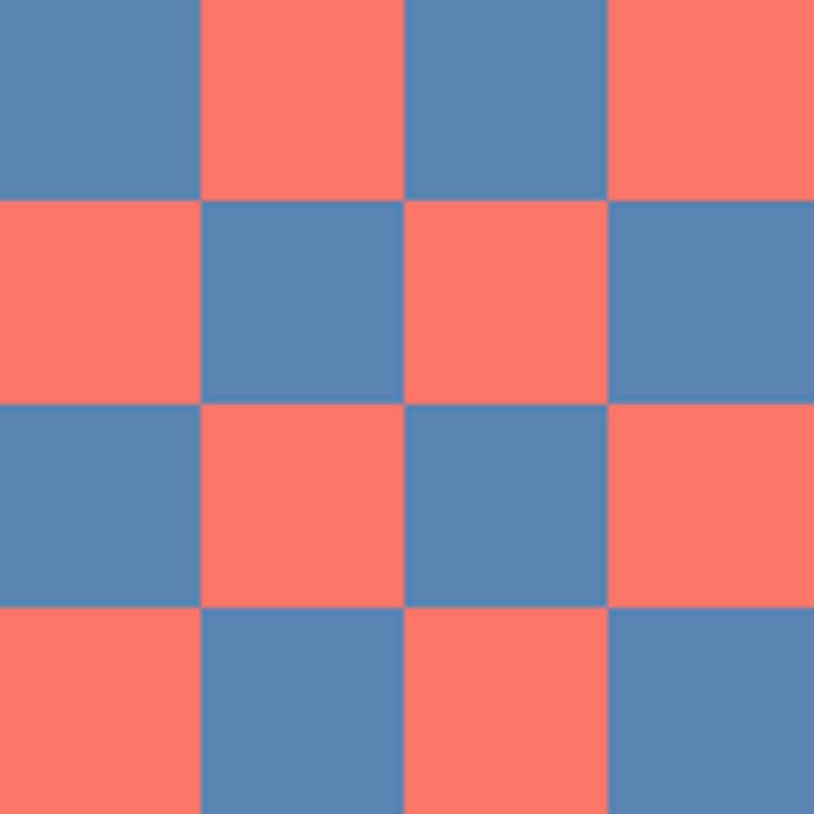

# [실습7] 체크 무늬 만들기

#### 체크 무늬를 만들어 봅시다.

-   이미지의 해상도는 128x128입니다. 각각의 방(cell)은 넓이와 높이가 모두 32 픽셀입니다. 따라서 4x4 = 16개의 셀이 생기도록 만들어 보세요.
-   색은 서로 다른 두 가지 색을 사용하셔도 됩니다. 저는 Living Coral (#FC766AFF), Pacific Coast(#5B84B1FF)를 사용했습니다.
-   여러분들도 좋아하는 색을 사용해보세요. "good couple colors"를 검색해서 [이 페이지](https://www.designwizard.com/blog/design-trends/colour-combination)를 찾았습니다.
-   갑자기 16진수가 나와서 당황스러우실 것 같지만 기본 문법을 복습하면서 해결해보세요.
-   체커 보드 패턴(checker board pattern)만드는 방법도 초보자에게 쉽진 않습니다. 우아한 정답을 찾으시기 보다는 단순 무식(brute force)하더라도 주어진 조건에 맞춰 결과를 만들어 내는 데에 집중하세요. 하나하나 배우다보면 실력은 자연스럽게 좋아집니다. 나름대로의 방식으로 먼저 시도해보시기를 권장합니다.

<예시>

