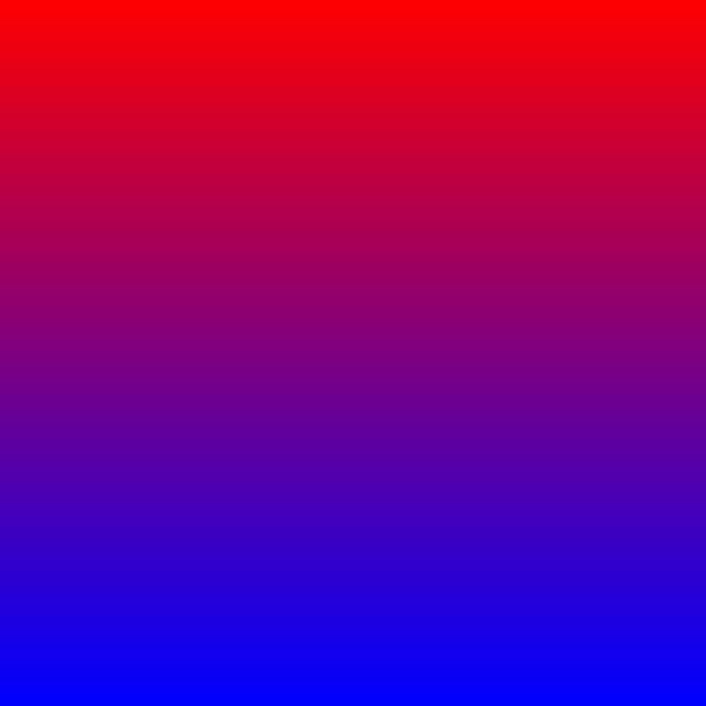

# [실습7] 그라데이션(Gradation) 효과

#### 위에서 아래로 그라데이션 효과를 만들어 보세요.

-   j에 따라서 색을 섞는 비율을 바꿔주면 됩니다.
-   색을 섞을 때는 R, G, B를 따로따로 섞어주면 됩니다. 예를 들어서 빨강과 파랑을 반반 섞은 색은 (127.5 0, 127.5)입니다.
-   실수(float, double 등)로 바꿔서 섞은 후에 다시 무부호 정수로 바꾸는 것이 일반적입니다.
-   인간의 눈으로 미묘한 색의 차이(예를 들어 127과 127.5)를 구분하기 어렵기 때문에 대부분의 경우 1바이트 무부호 정수를 사용합니다.
-   예를 들어 흰색과 검은색을 8:2로 섞는다면 R, G, B 각각 255.0 * 0.8 + 255.0 * (1.0 - 0.8)와 같은 방식으로 계산할 수 있겠지요.
-   좌에서 우로, 대각선 방향으로 만들어 보시는 것도 좋은 연습입니다.
-   뒤에서 **선형 보간(linear interpolation)**과 연결됩니다.

